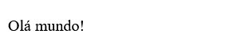
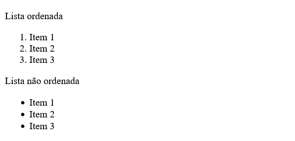
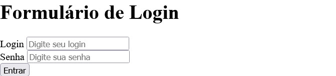
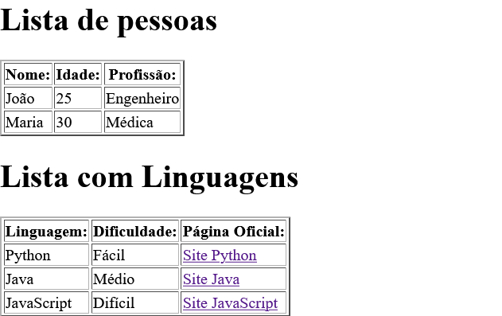
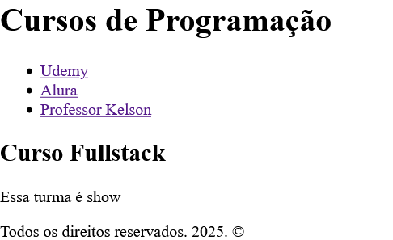

# Exercícios Aula 01
Este repositório contém os arquivos feitos no curso FullStack juntamente com as capturas de tela dos resultados dos arquivos desenvolvidos utilizando HTML e CSS.

---

## 🖼️ Capturas de Tela
> Abaixo estão os prints representando o resultado final de cada arquivo.html

<details>
  
  <summary>🖼️ Prints</summary>

---

  📌 Exercício 01
  
  

  📌 Exercício 02
  
  

  📌 Exercício 03
  
  

  📌 Exercício 04
  
  
  
 📌 Exercício 05
 
  
  
 📌 Exercício 06
 
  
  
 📌 Exercício 07
  
  
  
  📌 Exercício 08
  
  
  
</details>

---

## 📁 Estrutura do Repositório
```shell
$ workspace_casa/
├── aula01
│   └── assets/
│     └── logo.png
│   └── styles/
│     └── style.css
│   └── 1_estrutura_basica.html
│   └──2_trabalhando_com_textos.html
│   └── 3_listas.html
│   └── 4_links_e_imagens.html
│   └── 5_formularios.html
│   └── 6_tabelas.html
│   └── 7_elementos_semanticos.html
│   └── 8_desafio_cv.html
└── README.MD
```

---

## 🚀 Tecnologias Utilizadas
 
